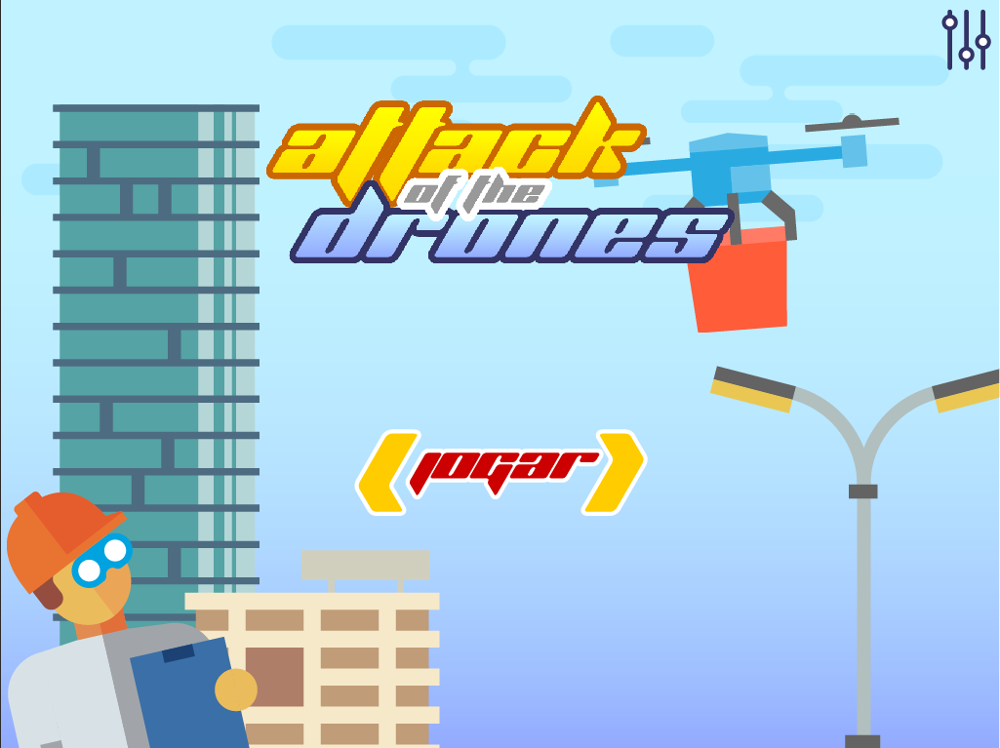

# Attack of the Drones

A 2D action game where players defend civilians from waves of enemy drones. Originally built with **Cocos2d + Swift (iOS)**, the project has been fully migrated to **Godot 4** (GDScript) with multiplatform export support.

---

## Screenshots

| Home Screen | Gameplay |
|:-----------:|:--------:|
|  |  |

---

## Gameplay

Drones continuously fly in from both sides of the screen, dropping projectiles on civilians below. The player rotates a turret at the center to shoot down drones and intercept enemy projectiles before they hit the civilians.

- **Tap/click** to aim and fire toward the target
- **Destroy drones** for 100 points each
- **Intercept enemy projectiles** for 50 points each
- **Protect civilians** — each one killed costs a life
- **5 lives** to start; reach zero and the game is over

---

## Project Structure

```
AttackOfTheDrones/
├── AttackOfTheDrones/          # Original iOS app (Cocos2d + Swift)
│   ├── Classes/
│   │   ├── Scenes/             # HomeScene, GameScene, LoadingScene, SettingsScene
│   │   ├── Objetos/            # Aviao, Pessoa, TiroPlayer, TiroInimigo
│   │   └── TSTUtils/           # StateMachine, SoundPlayHelper, DelayHelper, KeyChainHelper
│   ├── Resources/              # Sprites, audio, plist animations
│   └── Supporting Files/
├── AttackOfTheDrones.xcodeproj # Xcode project
└── godot/                      # Godot 4 port (active)
    ├── project.godot
    ├── scenes/                 # .tscn scene files
    ├── scripts/                # GDScript source files
    ├── assets/                 # Images, audio, animations
    └── screenshots/
```

---

## Godot 4 Port

The `godot/` folder contains the complete, playable Godot 4 version of the game. See [`godot/README.md`](godot/README.md) for full details on the migration, game mechanics, and how to open the project.

### Quick Start

1. Install [Godot 4](https://godotengine.org/download) (4.3 or newer)
2. Open Godot → **Import** → select the `godot/` folder → open `project.godot`
3. Press **F5** to run

### Migration Summary

| Original (Cocos2d / Swift) | Godot 4 (GDScript) |
|---|---|
| `StateMachine.swift` | `GameState.gd` (Autoload) |
| `SoundPlayHelper.swift` | `SoundManager.gd` (Autoload) |
| `GameScene.swift` | `GameScene.gd` + `GameScene.tscn` |
| `Aviao.swift` | `Drone.gd` + `Drone.tscn` |
| `Pessoa.swift` | `Person.gd` + `Person.tscn` |
| `TiroPlayer.swift` | `PlayerBullet.gd` + `PlayerBullet.tscn` |
| `TiroInimigo.swift` | `EnemyProjectile.gd` + `EnemyProjectile.tscn` |
| Chipmunk physics | Godot built-in 2D physics |
| ObjectAL audio | Godot `AudioStreamPlayer` |
| Cocos2d CCAction animations | Godot `Tween` / `AnimatedSprite2D` |

---

## Original iOS Project

The `AttackOfTheDrones/` folder and `AttackOfTheDrones.xcodeproj` contain the original Cocos2d-based iOS implementation in Swift. Open the `.xcodeproj` in **Xcode** to build and run on iOS.

---

## License

This project is for personal/educational use.
